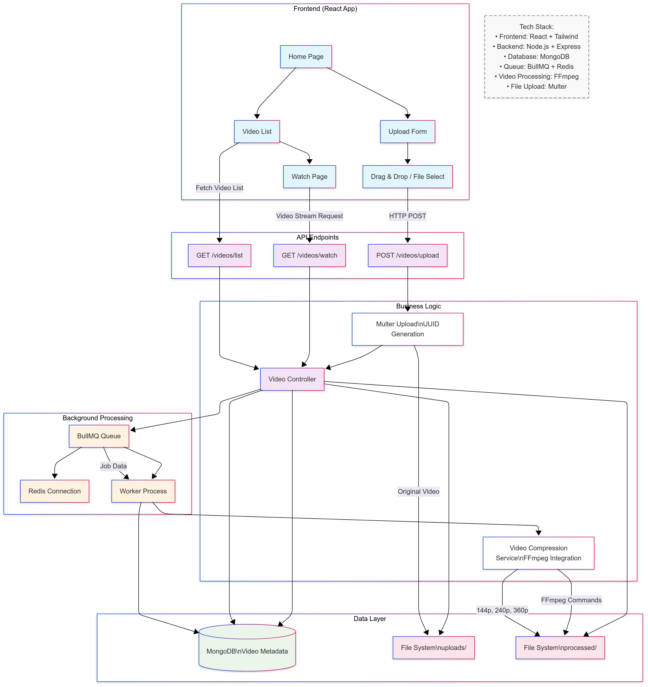

# Video Compression Pipeline

A full-stack video compression and streaming platform that automatically processes uploaded videos into multiple resolutions (144p, 240p, 360p) using FFmpeg, with real-time progress tracking and adaptive streaming capabilities.

## 🚀 Features

- **Drag & Drop Upload**: Intuitive file upload interface with support for various video formats
- **Automatic Compression**: Background processing into multiple resolutions using FFmpeg
- **Real-time Status Tracking**: Monitor upload and processing progress
- **Adaptive Streaming**: HTTP range request support for efficient video delivery
- **Quality Selection**: Switch between original, 144p, 240p, and 360p on the fly
- **Responsive Design**: Modern UI built with React and Tailwind CSS
- **Scalable Architecture**: Queue-based processing with Redis and BullMQ

## 🏗️ Architecture



## 🛠️ Tech Stack

### Frontend
- **React 19.1.0** - Modern React with hooks
- **Tailwind CSS 3.4.17** - Utility-first CSS framework
- **React Router Dom 7.6.1** - Client-side routing
- **Axios 1.9.0** - HTTP client for API requests

### Backend
- **Node.js & Express 5.1.0** - Server framework
- **MongoDB & Mongoose 8.3.4** - Database and ODM
- **BullMQ 5.52.0** - Redis-based job queue
- **Redis (IORedis 5.6.1)** - In-memory data store
- **FFmpeg (Fluent-FFmpeg 2.1.3)** - Video processing
- **Multer 1.4.5** - File upload middleware

## 📋 Prerequisites

- Node.js (v16 or higher)
- MongoDB (local or cloud instance)
- Redis server
- FFmpeg installed on system

## ⚡ Quick Start

### 1. Clone the Repository
```bash
git clone https://github.com/Vatsalmadhur/video_compression_pipeline.git
cd video_compression_pipeline
```

### 2. Install Dependencies

**Backend Setup:**
```bash
cd server
npm install
```

**Frontend Setup:**
```bash
cd client
npm install
```

### 3. Environment Configuration

Create `.env` file in the `server` directory:
```env
PORT=6000
FRONTEND_URL=http://localhost:3000
MONGODB_URI=mongodb://127.0.0.1:27017/video-pipeline
REDIS_URL=redis://localhost:6379
```

Create `.env` file in the `client` directory:
```env
REACT_APP_BASE_URL=http://localhost:6000
```

### 4. Start Services

**Start MongoDB & Redis:**
```bash
# MongoDB (if running locally)
mongod

# Redis
redis-server
```

**Start Backend:**
```bash
cd server
node server.js
```

**Start Frontend:**
```bash
cd client
npm start
```

Visit `http://localhost:3000` to access the application.

## 📡 API Endpoints

| Method | Endpoint | Description |
|--------|----------|-------------|
| `POST` | `/videos/upload` | Upload video file |
| `GET` | `/videos/list` | Get all videos with metadata |
| `GET` | `/videos/watch?v={hash}&res={quality}` | Stream video with optional quality parameter |

### Example API Usage

**Upload Video:**
```javascript
const formData = new FormData();
formData.append('video', file);
const response = await axios.post('/videos/upload', formData);
```

**Stream Video:**
```html
<video controls>
  <source src="/videos/watch?v=video-hash&res=360p" type="video/mp4">
</video>
```

## 🔧 Video Processing Pipeline

1. **Upload**: Video uploaded to `uploads/` directory with UUID
2. **Queue Job**: Processing job added to BullMQ queue
3. **Background Processing**: Worker processes video into multiple resolutions:
   - 144p (CRF 28, slow preset)
   - 240p (CRF 28, slow preset)
   - 360p (CRF 28, slow preset)
4. **Storage**: Compressed videos saved to `processed/` directory
5. **Status Update**: Database updated from "processing" to "ready"

### FFmpeg Command Used
```bash
ffmpeg -i "input.mp4" -vcodec libx264 -crf 28 -preset slow -vf "scale='trunc(iw*{resolution}/ih/2)*2':{resolution}" -c:a aac -b:a 128k "output.mp4"
```

## 📁 Project Structure

```
video_compression_pipeline/
├── client/                 # React frontend
│   ├── public/
│   ├── src/
│   │   ├── components/     # Reusable UI components
│   │   ├── pages/          # Route components
│   │   ├── utils/          # API clients
│   │   └── App.js
│   └── package.json
├── server/                 # Express backend
│   ├── controllers/        # Route handlers
│   ├── db/                # Database connection
│   ├── jobs/              # Queue workers
│   ├── model/             # MongoDB schemas
│   ├── routes/            # API routes
│   ├── services/          # Business logic
│   ├── uploads/           # Original video storage
│   ├── processed/         # Compressed video storage
│   └── server.js
└── README.md
```

## 🚦 Development

### Running Tests
```bash
# Frontend tests
cd client
npm test

# Backend tests (add test scripts as needed)
cd server
npm test
```

### Building for Production
```bash
# Build frontend
cd client
npm run build

# Start production server
cd server
NODE_ENV=production node server.js
```

## 🔧 Configuration Options

### Video Quality Settings
Modify resolutions in `server/jobs/videoProcessing.js`:
```javascript
const resolutions = [144, 240, 360, 480, 720]; // Add more resolutions
```

### Upload Limits
Configure in `server/routes/videoRoutes.js`:
```javascript
const upload = multer({
  storage,
  limits: { fileSize: 100 * 1024 * 1024 } // 100MB limit
});
```

## 🛡️ Security Considerations

- Input validation for file uploads
- File type restrictions
- Rate limiting (recommended for production)
- Authentication/authorization (implement as needed)
- Secure file storage practices

## 🐛 Troubleshooting

### Common Issues

**FFmpeg not found:**
```bash
# Ubuntu/Debian
sudo apt update && sudo apt install ffmpeg

# MacOS
brew install ffmpeg

# Windows
# Download from https://ffmpeg.org/download.html
```

**MongoDB connection issues:**
- Ensure MongoDB is running
- Check connection string in `.env`
- Verify database permissions

**Redis connection issues:**
- Ensure Redis server is running
- Check Redis configuration
- Verify port availability (default: 6379)

## 🤝 Contributing

1. Fork the repository
2. Create your feature branch (`git checkout -b feature/AmazingFeature`)
3. Commit your changes (`git commit -m 'Add some AmazingFeature'`)
4. Push to the branch (`git push origin feature/AmazingFeature`)
5. Open a Pull Request

## 📄 License

This project is licensed under the ISC License - see the [LICENSE](LICENSE) file for details.

## 🙏 Acknowledgments

- FFmpeg community for video processing capabilities
- BullMQ for robust job queue implementation
- React and Express.js communities for excellent documentation

## 📞 Support

If you encounter any issues or have questions, please:
1. Check the [Issues](https://github.com/Vatsalmadhur/video_compression_pipeline/issues) page
2. Create a new issue if your problem isn't already reported
3. Provide detailed information about your environment and the issue

---

**Made with ❤️ by [Vatsal Madhur](https://github.com/Vatsalmadhur)**
